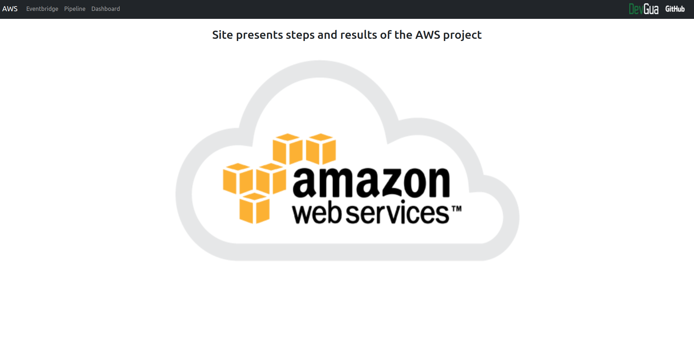
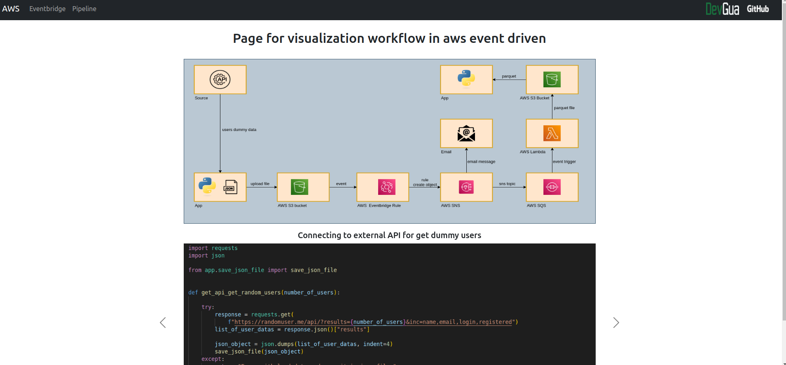
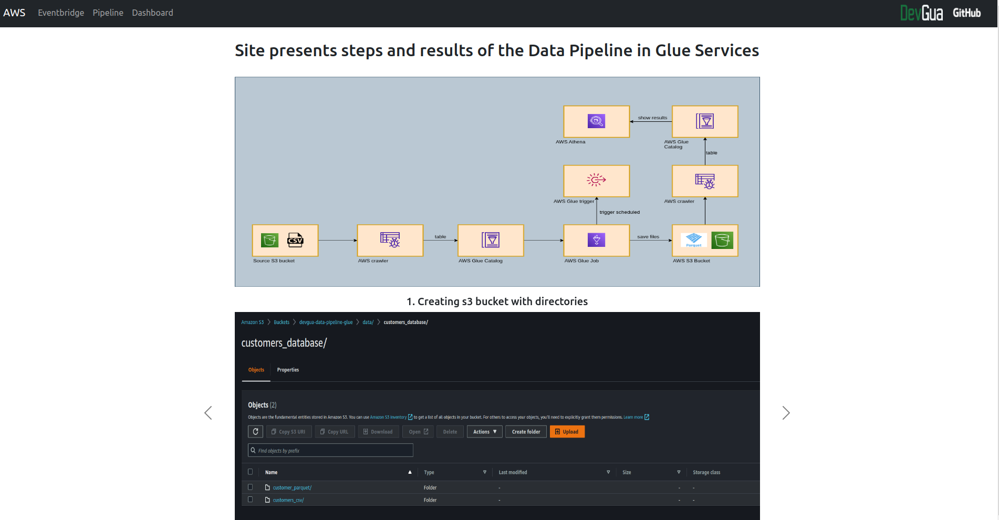
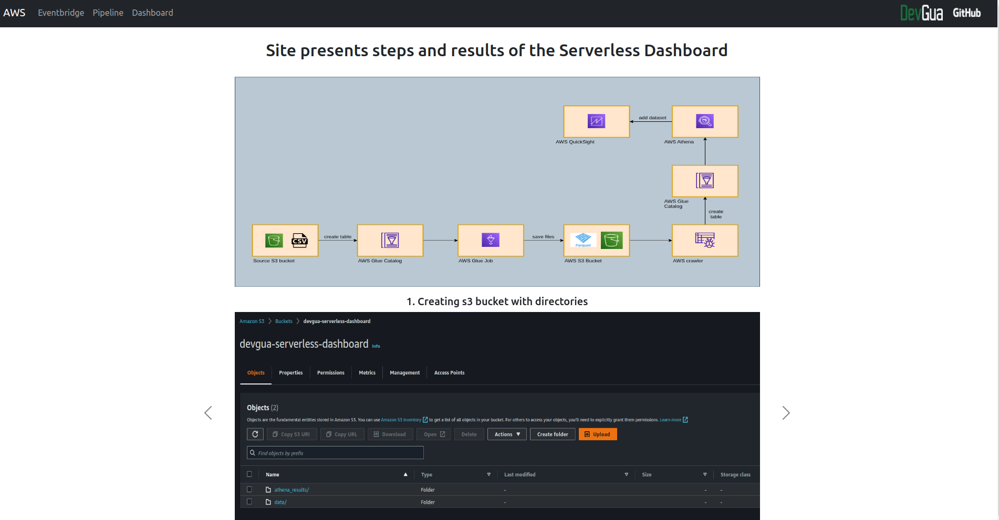
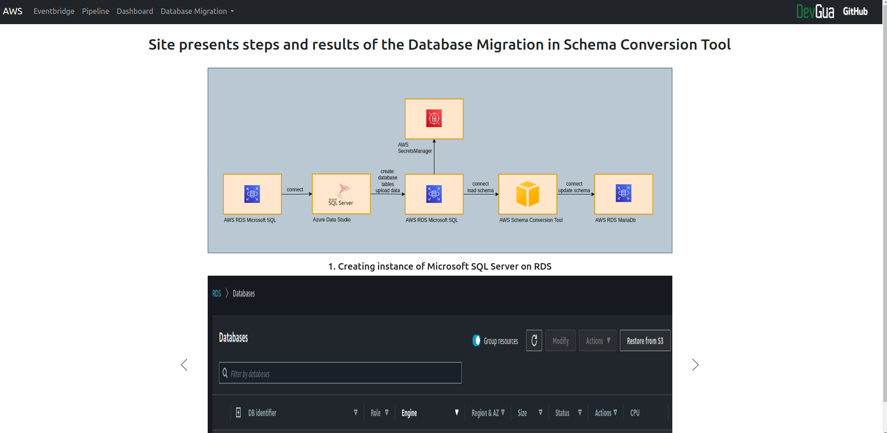
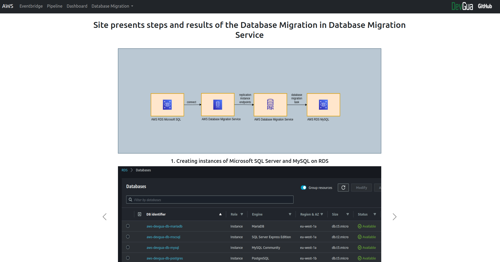

# AWS SERVICES WORKFLOW
> This application shows images with projects on aws services. 
> Live demo [_here_](http://mateuszgua.pythonanywhere.com/).

## Table of Contents
* [General Info](#general-information)
* [Technologies Used](#technologies-used)
* [Features](#features)
* [Screenshots](#screenshots)
* [Project Status](#project-status)
* [Contact](#contact)

## General Information
- This project was created because I wanted to show my projects from aws services.

## Technologies Used
- Python - version 3.10.6
- Flask - version 2.2.3

## Features
List the ready features here:
- Creating view to show data eventbridge with s3 bucket and lambda,
- Createing view to show data pipeline in glue and show results in athena,
- Creating view to show dashboard in athena and quicksight,
- Creating view to show database migration with schema conversion tool,
- Creating view to show database migration with database migration services

## Screenshots
Page with project workflow

## Project Status
Project is: in_progress

## Contact
Created by [@DevGua]() - feel free to contact me!
